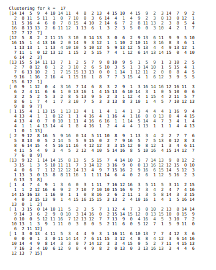

Data Mining
# Topology Mapping
**26th November 2020**

#
# **Problem Statement**
Simulating large-scale network experiments requires powerful physical resources. However, partitioning could be used to reduce the required power of the resources and to reduce the simulation time. Topology mapping is a partitioning technique that maps the simulated nodes to different physical nodes. In this assignment, we will use spectral clustering to partition a given network topology on the available physical nodes. The network topology is a graph of N nodes communicating with each other by sending data traffic through a set of edges. An edge in the topology is weighted by the traffic (Mbps) passing through it. Our clustering technique should find the cut that minimizes the traffic between different partitions (Emulated traffic in the figure below). 

# **Dataset** 
Our code takes data as 2 parts

1. Topology networks as a list of graphs “using networkx” for each topology there is a list.
1. 2d arrays for ground truth for the two topologies

# **Visualize the Topologies**
Using draw in networx library we visualize all networks in all topologies

For example this is visualization of t\_10\_1

# **Topology Mapping**
## **Similarity matrix and the degree matrix △.**
We build the similarity matrix A with edges’ weights as a result from the networkx and saving all the networks in list of size 10 contains all the 10 2D matrices

Compute the degree matrix from the similarity matrix.

## **Spectral clustering algorithm**
The function of spectral clustering taking the number of clusters and the list of files of 10 or 50 or 100 which and the number of them.

Calculate the similarity of them.

Define a list of clusters and labels to save in them the result of each file.

For each similarity matrix calculate the degree matrix, laplacian, then the asymmetric laplacian.

Get the eigenvalues and eigenvectors, then calculate the U matrix.

Calculate the clusters and their adjacent labels using the K-means.

According to the algorithm:

# **Evaluation**
## ` `**External evaluation techniques: Conditional Entropy, and F-Measure.**
**Conditional entropy:**

We use this equation to calculate the conditional entropy for each cluster.

And use this equation to calculate the overall conditional entropy

**F-measure**

We get the contingency matrix by giving it the truth and the predicted labels, then calculate the purity and the recall and use this equation to calculate the F-measure.

Then calculate the total F-measure by using this equation.

## **Normalized-Cut evaluation technique**
We implement some functions to help in calculations, one for changing clusters to subgraphs, other to calculate external distance of a cluster and other to calculate internal distance. Last one is to calculate the normalized cut, it uses w = e^-0.01w as mentioned in the pdf.

\_\_\_\_\_\_\_\_\_\_\_\_\_\_\_\_\_\_\_\_\_\_\_\_\_\_\_\_\_\_\_\_\_\_\_\_\_\_\_\_\_\_\_\_\_\_\_\_\_\_\_\_\_\_\_\_\_\_\_\_\_\_\_\_\_\_\_\_\_\_\_\_\_\_\_

def get\_cluster\_graphs(G,k,labels,n):
`  `nodes = []
`  `global figure\_index
`  `color = ["#"+''.join([random.choice('0123456789ABCDEF') for j in range(6)])
`             `for i in range(k)]
`  `for i in range (0,k):
`    `nodes.append([])
`  `for i in range (0,n):
`    `nodes[labels[i]].append(str(i+1))
`  `graphs = []
`  `c = 0
`  `figure\_index+=1
`  `for i in nodes:
`    `newG = G.subgraph(i)
`    `plt.figure(figure\_index, figsize=(10,10))
`    `pos = nx.spring\_layout(newG)
`    `nx.draw\_networkx(newG,pos,node\_color= color[c]) #,ax = ax[c]
`    `labels = nx.get\_edge\_attributes(newG,'weight')
`    `nx.draw\_networkx\_edge\_labels(newG,pos,edge\_labels=labels)
`    `graphs.append(newG)
`    `c+=1
`  `return graphs
def internal\_dist(G):
`  `distance = 0
`  `for u,v,w in G.edges(data = 'weight'):
`    `distance += math.exp(-0.01\*w)
`  `return distance
def external\_dist(G,rest\_edges):
`  `distance = 0
`  `for u,v,w in rest\_edges:
`    `if (u in G.nodes) or ( v in G.nodes):
`      `distance += math.exp(-0.01\*w)
`  `return distance
def NCmeasurment(V,clusters):
`  `all\_edges = V.edges(data = 'weight')
`  `rest\_edges = all\_edges
`  `for i in clusters:
`    `edgelist = i.edges(data = 'weight')
`    `rest\_edges = [fruit for fruit in all\_edges if fruit not in edgelist]
`    `all\_edges = rest\_edges
`  `NC = 0
`  `for i in clusters:
`    `e = external\_dist(i,rest\_edges)
`    `if (e == 0):
`      `e = 1
`    `NC+= 1/(1+(internal\_dist(i)/e))
`  `return NC
\_\_\_\_\_\_\_\_\_\_\_\_\_\_\_\_\_\_\_\_\_\_\_\_\_\_\_\_\_\_\_\_\_\_\_\_\_\_\_\_\_\_\_\_\_\_\_\_\_\_\_\_\_\_\_\_\_\_\_\_\_\_\_\_\_\_\_\_\_\_\_\_\_\_\_

Then we run this code to get Normalized cut for topology 100 for all K values.

\_\_\_\_\_\_\_\_\_\_\_\_\_\_\_\_\_\_\_\_\_\_\_\_\_\_\_\_\_\_\_\_\_\_\_\_\_\_\_\_\_\_\_\_\_\_\_\_\_\_\_\_\_\_\_\_\_\_\_\_\_\_\_\_\_\_\_\_\_\_\_\_\_\_\_

Note: We try it on K = 2 topology 10 just for testing and this is t\_10\_1 after partitioning with Nc = 1.1521604205454474

# **Big Picture** 
## **Run the clustering with the different values of K**
***For t\_10***

***For t\_50***

***For t\_100***

## **Evaluation for each clustering found**
***For t\_10***

***(conditional entropy)***

***(F-measure)***

***For t\_50***

***(conditional entropy)***

***(F-measure)***

***For t\_100***

***(Normalized cut)***

## **Best clustering based on evaluation**
The best evaluation is the conditional entropy measurement evaluation on the average of all clusters as each ground truth is clustered according to the number of clusters in it.
##
##
##
##
##
##
##
## **Report the amount of traffic running internally in each individual partition, and the total amount of emulated traffic between different partitions (sum of the cut weights between different clusters)**

***Visualization:***

***before***

***After***

***The rest in the Notebook*** 

